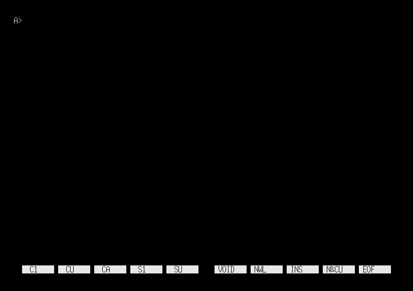

# shutdown

[English](README.md) | [日本語](README.ja.md)

<p align="center">
  
</p>

<p align="center">
  <strong><a href="https://uraraworks.github.io/WebX68k/?cpu=10&ram=12&fd1=https://raw.githubusercontent.com/renatus-novus-x/shutdown/main/dist/shutdown.zip&run=1">▶ WebX68kでshutdownを起動</a></strong>
</p>

Sharp X68000 / Human68k用の、電源オフと再起動を行う最小ユーティリティです。

## 使用方法

```text
shutdown -h now        システムの電源を切る
shutdown -r now        システムを再起動する
shutdown --direct now  $E8E00Fから直接電源を切る（実験用）
shutdown -?            usageを表示する
shutdown --help        usageを表示する
```

引数なしで`shutdown`を実行した場合はusageを表示するだけで、電源オフや再起動は
行いません。生成したディスクイメージも、Human68k起動後に`AUTOEXEC.BAT`から
引数なしで実行し、usageを表示します。

通常の電源オフと再起動にはX68000の`TRAP #10`を使用します。実験用の`--direct`は
この処理を迂回し、ハードウェア診断のために`$E8E00F`へ直接書き込みます。いずれの
終了コマンドも、ファイル操作を完了してから実行してください。

## ビルド

elf2x68kを導入し、`m68k-xelf-gcc`に`PATH`が通ったWSLまたはLinux環境でビルドします。

必要なホストツールをインストールします。

```sh
sudo apt install python3 curl unar
```

リポジトリ直下から`src`へ移動し、すべての成果物を作成します。

```sh
cd src
make
```

MakefileはHuman68k 3.02とバージョンを固定した`xdftool.py`をダウンロードし、次の
ファイルを作成します。

```text
src/shutdown.x     Human68k実行ファイル
src/shutdown.xdf   起動可能なHuman68kディスクイメージ
dist/shutdown.zip  Human68k許諾条件を含む配布用アーカイブ
```

生成したディスクイメージの内容を確認する場合は次を実行します。

```sh
make check-xdf
```

生成ファイルは`make clean`で削除できます。ダウンロードした補助ファイルも
削除する場合は`make distclean`を使用します。